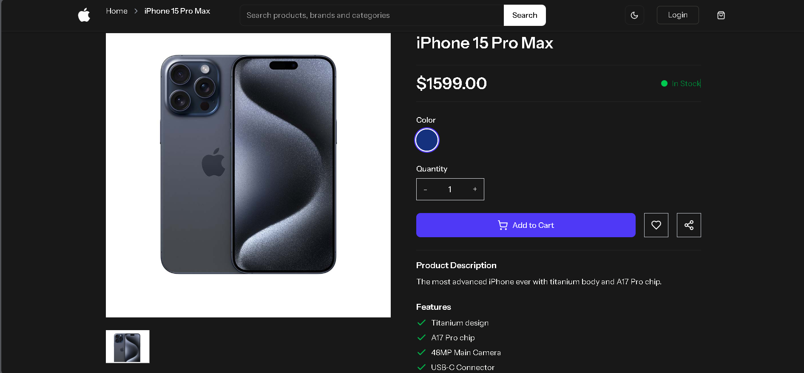
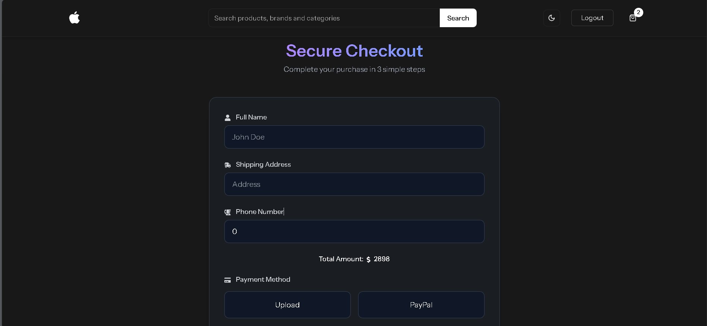
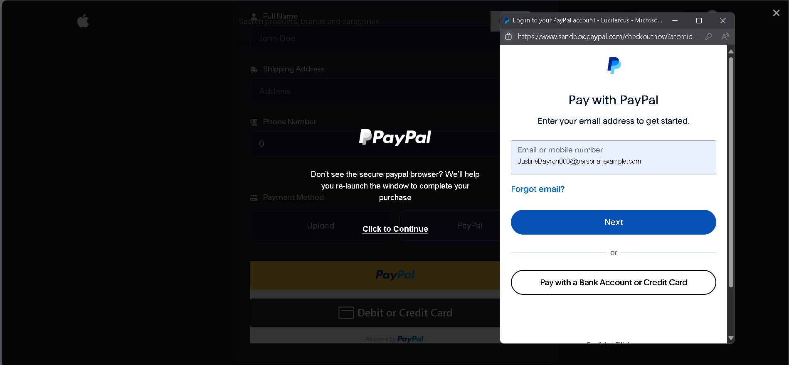
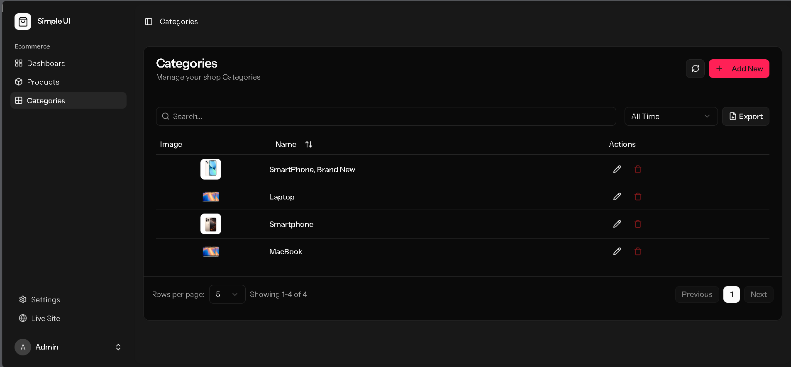

# 🍎 iPhoneHub – E-Commerce Platform for New and Pre-Owned iPhones  

iPhoneHub is a full-stack web-based e-commerce platform dedicated to selling both **brand-new** and **second-hand** iPhones. 
It aims to provide a convenient, trustworthy, and user-friendly marketplace that caters to a wide range of customers—from tech enthusiasts chasing the latest Apple models to budget-conscious users exploring affordable, pre-owned options.  

By bridging premium and sustainable shopping choices, iPhoneHub promotes accessibility and eco-conscious consumerism.  

---

## 🛒 Features
- 📱 **Product Listings** – Browse detailed pages for new and used iPhones with photos, specs, and prices  
- 🛍️ **Shopping Cart** – Add/remove items with real-time updates  
- 💳 **Checkout & Orders** – Secure checkout workflow  
- 🛠️ **Admin Panel** – Product, inventory, and user management  
- 📦 **Inventory Management** – Separate handling for new and second-hand devices  
- ✅ **Authentication** – Role-based access (admin, customer)

---

## 🧱 Tech Stack

| Layer       | Technology            |
|-------------|------------------------|
| Frontend    | **React**,  TypeScript |
| Backend     | **Laravel (PHP)**      |
| Database    | **PostgreSQL**         |
| Styling     | Tailwind CSS           |
| REST API    | Laravel API routes     |
| Auth        | Laravel Sanctum        |

---

## 🚀 Getting Started

### ⚙️ Prerequisites

- Node.js (v16+)
- PHP 8.1+
- Composer
- PostgreSQL
- Laravel CLI


SETUP 
```bash
git clone https://github.com/samanthagwynetha/IphoneHubStore.git  
cd IphoneHubStore  
composer install  
cp .env.example .env  

copy paste env:  
DB_CONNECTION=pgsql  
DB_HOST=127.0.0.1  
DB_PORT=5432  
DB_DATABASE=iphonehubDB( or your DB)
DB_USERNAME=postgres 
DB_PASSWORD=yourpass

php artisan config:clear
php artisan migrate --seed
php artisan key:generate

npm install
npm run dev
php artisan serve
```

## 📷Screenshots
### AUTHENTICATION


### HOME



### ORDER



### ADMIN




